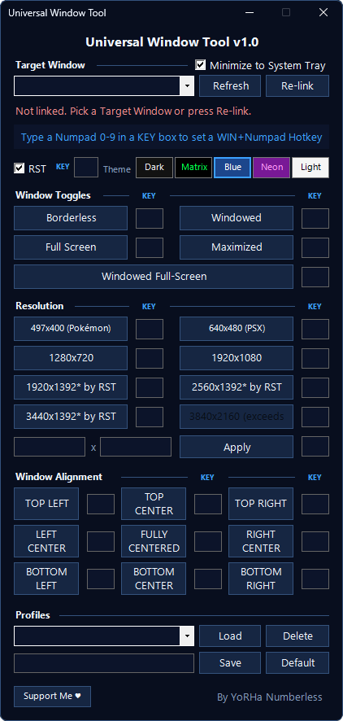

# Universal Window Tool

Take control of any application window, including games, emulators, video players, editors, browsers, file explorer, etc. Force exact resolutions, borderless and fullscreen modes, nine alignment anchors, global in-game hotkeys, with custom profiles.

No installer. No dependencies. Nothing is patched, injected or modified in the target program — the tool only talks to the window the system already created.

---

## Why you would want this

**Games that refuse to give you the resolution you want.** Plenty of titles offer a short list of windowed sizes, scale to something ugly, or drop the option entirely. This sets the window to any size you type, and the size you get is the size you asked for — borders excluded, not counted in.

**Games with no borderless mode.** Older titles, indie releases, emulators and fan recompilation projects often ship with a plain framed window and nothing else. One click removes the title bar and frame, another puts it back. The game never knows.

**Emulators and recomp projects.** These frequently open at an odd native size and offer only integer scaling steps. Set whatever intermediate size actually fits your screen.

**Video players while you work.** Park a player borderless in a corner at an exact size, sitting flush against the screen edge instead of a few pixels off it, and keep it clear of the taskbar automatically. Change corner or size with a hotkey without touching the mouse.

**Recording and capture.** Window capture in OBS and similar tools behaves far better when the source is a known exact size. Set 1920x1080 once, save it as a profile, and reload it next session instead of dragging edges by hand.

**Multi-monitor setups.** Drag the target window to another display and everything follows automatically: alignment anchors, taskbar handling, and the resolution limits, which re-evaluate against whichever monitor the window is currently on.

**Without leaving the game.** Assign `WIN + Numpad` shortcuts and switch between borderless, fullscreen, a given resolution or a screen corner mid-session, with the game focused. The Numpad is deliberate: no game binds it together with the Windows key, so nothing collides with movement, crouch or sprint.

---

## Features

**Target Window** — Choose any open window from the dropdown. `Refresh` rebuilds the list. `Re-link` finds the same program again after you close and reopen it, which is the usual case with games, without losing your settings.

**Window Toggles**

| Mode | What it does |
|---|---|
| `Borderless` | Removes title bar and frame, keeps the current size |
| `Windowed` | Restores the frame, keeps the current size |
| `Full Screen` | Borderless, covering the whole monitor |
| `Maximized` | Windows' own maximize, on the monitor the window is on |
| `Windowed Full-Screen` | Fills the monitor but stays a normal window, so Alt+Tab is instant |

**Resolution** — Presets for 497x400, 640x480, 1280x720, 1920x1080, 1920x1440, 2560x1440, 3440x1440 and 3840x2160, plus a free custom field from 200x150 up to the size of the current monitor. A preset that does not fit is disabled and says so on the button, rather than silently giving you something smaller. When RST trims a preset, the button shows the size you will actually get, marked with an asterisk, for example `1920x1392* by RST`.

**Window Alignment** — Nine anchors: top, middle and bottom, each with left, centre and right. Pick one and it persists across resolution changes. Drag the window by hand and the tool notices, backs off and leaves it exactly where you put it until you choose an anchor again.

**RST (Respect System Toolbar)** — Keeps the window clear of the Windows taskbar wherever it is docked — bottom, top, left or right — at whatever thickness it has, including custom sizes and the larger Windows 11 bar, and evaluated per monitor. If the taskbar is set to auto-hide, RST steps aside automatically, since a hidden bar takes no space. Toggle it and the window re-adjusts immediately. Presets whose size gets trimmed by the taskbar display the adjusted value on the button, so there are no surprises.

**Pixel-accurate placement** — Windows gives resizable windows an invisible grab border a few pixels wide on the left, right and bottom. Most tools ignore it, which is why "align right" often leaves a visible gap. This one measures that border per window and compensates, so edges sit flush and a requested 1920x1080 really is 1920x1080 of visible window.

**Hotkeys** — Type a number in any `KEY` box to bind that action to `WIN + Numpad <number>`. Duplicates are rejected and the tool names the action that already owns the key. If another application has claimed a combination, it tells you instead of failing quietly.

**Profiles** — Save every setting under a name, reload it in one click, or mark one as the startup profile. Profiles store options only, never which window was linked, so the same profile works for any program.

**System Tray** — Minimize and the tool hides into the tray with hotkeys still live. Right-click the icon to switch target window, load a profile, re-link or exit.

**Themes** — Dark, Matrix, Blue, Neon and Light. The choice persists between sessions and applies to the tray menu and the window title bar as well.

---

## Requirements

- Windows 10 (version 1809 or newer) or Windows 11
- Administrator rights, granted through the UAC prompt on launch
- No .NET install, no Python, no runtime. Everything lives inside the single `.bat`

## Installation

1. Download `Universal_Window_Tool_by_YoRHa_Numberless_v1.0.bat` from the [Releases](../../releases) page.
2. Put it anywhere. It does not need to sit next to any game and does not care where anything is installed.
3. Launch the program you want to control, then double-click the `.bat` and accept the UAC prompt.

The tool writes one file next to the `.bat`, `UniversalWindowTool_Profiles.json`, holding your profiles and theme. Delete it to reset everything. While running it also creates two temporary files in `%TEMP%` and removes them on exit.

### Why does it ask for administrator rights?

Windows refuses to let a normal-privilege process move or resize a window belonging to an elevated process, which many games are. Without elevation the tool would do nothing at all.

### Why might SmartScreen or my antivirus complain?

It ships as a single `.bat` that carries its own PowerShell payload and requests elevation. Heuristic scanners sometimes flag that shape on principle, without anything malicious being present. This is a false positive.

If your antivirus blocks or deletes the file:

1. Read the source first if you want to be sure. The complete, uncompressed PowerShell is published here as `UniversalWindowTool.ps1` — it is exactly what the `.bat` runs.
2. Add an exclusion for the `.bat` in your antivirus, or restore it from quarantine. In Microsoft Defender: **Windows Security → Virus & threat protection → Manage settings → Exclusions → Add an exclusion → File**.
3. If SmartScreen shows a blue warning instead, click **More info** and then **Run anyway**.

Reporting the false positive to your vendor also helps, and takes a minute on most of their sites.

---

## Known limitations

- Games running in **exclusive fullscreen** cannot be resized from outside by any tool. Switch the game to windowed mode first, then use `Windowed Full-Screen` here for the same look with faster Alt+Tab.
- Some games **re-apply their own size** when you change a video setting or on scene changes. Press the hotkey again; the tool does not fight the game continuously.
- **Per-theme title bar colours require Windows 11.** On Windows 10 the title bar only switches between dark and light.
- Some **anti-cheat systems** block external window manipulation. Nothing is injected here, but a strict anti-cheat may still object.
- A **hotkey already claimed** by another application cannot be registered; the tool warns you.
- Mixed **display scaling** between monitors (100% on one, 150% on another) can offset placement, as the tool is not per-monitor DPI aware yet.

---

## Roadmap

- Per-monitor DPI awareness for mixed-scaling setups.
- Native packaging and code signing.

---

## Permissions

- **No re-uploading.** This tool, in part or in whole, may not be re-uploaded to any site, platform or repository.
- **No editing without permission.** It may not be modified or reused to create derivative tools without explicit prior permission. Suggestions and corrections are welcome and can be proposed to the author.
- **No selling.** It may not be sold under any circumstances.
- **No bundling.** It may not be included in packs or compilations without explicit prior permission.

If you would like to use this material in a way not covered here, please get in touch first.

---

## Support

If you find it useful and want to support the time behind it:

https://www.tipeeestream.com/yorha-numberless/donation

Entirely optional and never required to use the tool.

---

## Source

`UniversalWindowTool.ps1` in this repository is the complete, readable source of what the `.bat` executes. The `.bat` simply carries an encoded copy of it, writes it to a temporary file, runs it and deletes it. Nothing else is downloaded or contacted at any point — the tool has no network access of any kind.

---

## Credits

Developed by **YoRHa Numberless**.

Other projects: https://www.nexusmods.com/profile/YoRHaNumberless/mods
